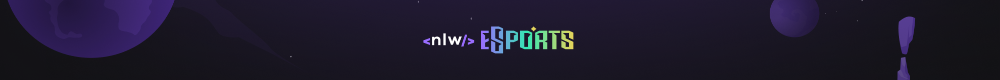

  

 
<h4 align="center"> 
	 Next Level Week eSports - Trilha Explorer 🚀 
</h4>
 

  
  <a href="https://davif91.github.io/NLW-eSports/" targert="_blank"> ▶️ Visualizar Página </a>

<h2 align=left> 💡​ Info. sobre o projeto </h3>

##

 Projeto realizado durante o evento <strong>NLW</strong> da <a href="https://www.rocketseat.com.br/"> <strong>Rocketseat</strong></a>

 

<h2 align=left> 🧰​ Tecnologias</h3>

##

 

<h2>🖥️​ NLW eSports </h2>

##

